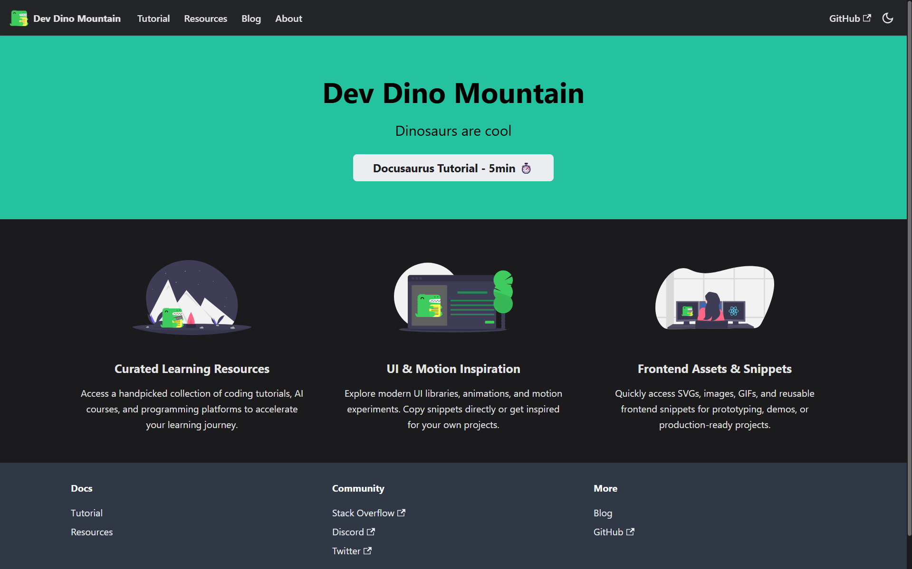

# ⛰️ Dev Mountain

> **Curated Dev Resources • Dynamic UI • T-Rex Energy**

A curated knowledge base for developers and designers — tools, UI/UX inspiration, motion design examples, workflow references, and more. Built with [Docusaurus](https://docusaurus.io/).



---

## 🗺️ Site Sections

| Tab | Folder | What lives here |
|---|---|---|
| **Resources** | `resources/` | The main content hub — links, guides, snippets |
| **Docusaurus Guide** | `docs/` | How this site is built and maintained |
| **Blog** | `blog/` | Dev notes, discoveries, updates |
| **About** | `src/pages/about.tsx` | Project info |

---

## ➕ How to Add Content

### Adding a Resource

1. Drop a `.md` file in `resources/`:
   ```md
   ---
   title: My Topic
   description: Short description
   ---

   ## My Topic

   - [Tool Name](https://example.com) — brief description
   ```
2. It auto-appears in the sidebar. No config changes needed.

### Adding a Blog Post

1. Create `blog/YYYY-MM-DD-my-post.md`:
   ```md
   ---
   slug: my-post
   title: My Post Title
   authors: [abdul]
   tags: [frontend, tools]
   ---

   Intro shown in the list view.

   <!-- truncate -->

   Full content here...
   ```

### Adding a Guide Page

1. Drop a `.md` file in `docs/`:
   ```md
   ---
   sidebar_position: 7
   ---

   # My Guide
   ```

### Editing the Navbar or Footer

Edit `docusaurus.config.ts` → `themeConfig.navbar.items` or `themeConfig.footer.links`, then restart the dev server.

> 📖 See [CONTRIBUTING.md](./CONTRIBUTING.md) for the full content guide.
> 🤖 See [AGENTS.md](./AGENTS.md) for the AI agent / automation reference.

---

## 🚀 Local Development

```bash
# Install dependencies
yarn

# Start dev server at http://localhost:3000
yarn start
```

Most changes hot-reload automatically. Config changes (`docusaurus.config.ts`, `sidebars.ts`) require a server restart.

## 📦 Build

```bash
yarn build
```

Generates static output in `build/`. Preview it with:

```bash
yarn serve
```

## 🚢 Deploy

**GitHub Pages via SSH:**

```bash
USE_SSH=true yarn deploy
```

**GitHub Pages without SSH:**

```bash
GIT_USER=<Your GitHub username> yarn deploy
```

**Vercel / Netlify:** connect the repo, set build command to `yarn build`, output directory to `build`.

---

## 🤝 Contributing

Feel free to suggest new resources, UI experiments, or motion examples. See [CONTRIBUTING.md](./CONTRIBUTING.md) for the full guide.

## 📬 Contact

Reach out via the [GitHub repository](https://github.com/AbdulDevHub/Dev-Mountain) or open an issue / PR.
