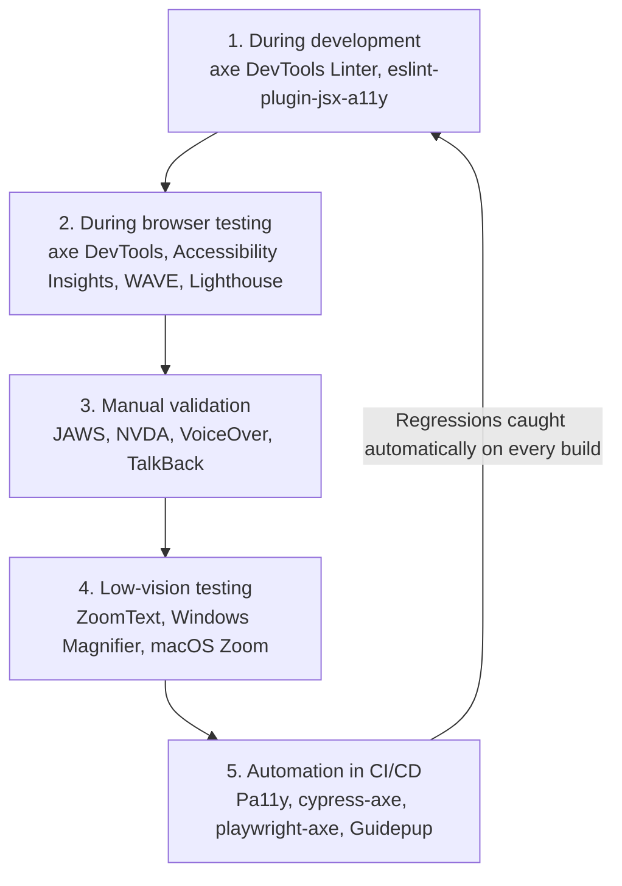

A consolidated reference of tools for building and verifying accessible digital experiences — from the assistive technology real users rely on, to the linters, browser extensions, and CI/CD tools that catch issues before they ship.

:::tip Big picture
Accessibility tooling splits into two families that are easy to conflate but serve different purposes:

1. **Assistive technology (AT)** — what disabled users actually use to interact with your product (screen readers, magnifiers, voice control). Testing with these is the closest you get to the real user experience.
2. **Developer/QA tooling** — linters, browser extensions, and automated test libraries that catch a *subset* of accessibility issues automatically, early, and repeatedly.

Neither family is a substitute for the other — see the [recommended workflow](#recommended-accessibility-testing-workflow) below.
:::

---

## 1. Assistive Technology (Manual Testing)

Testing with real assistive technology is the most reliable way to know whether an experience is actually usable, since automated tools only catch a fraction of real-world issues.

### 1.1 Screen Readers

Screen readers matter most for manual testing because they represent the direct experience of users who are blind or have severe visual impairments.

| Tool | Platforms | License | Key Features |
| :--- | :--- | :--- | :--- |
| **JAWS** | Windows | Commercial | Enterprise-standard; industry-leading ARIA support, advanced keyboard navigation, Braille display support |
| **JAWS Inspect** | Windows | Commercial | Companion tool that converts JAWS's spoken output into readable text logs — useful for debugging and writing bug reports |
| **NVDA** (NonVisual Desktop Access) | Windows | Free / Open-source | Lightweight, frequently updated, excellent standards compliance — the default choice for most manual testing on Windows |
| **VoiceOver** | macOS, iOS, iPadOS | Free (built-in) | Native Apple screen reader; gesture-based navigation; essential for Safari/iOS testing |
| **TalkBack** | Android | Free (built-in) | Gesture-based spoken feedback; essential for Android testing |
| **ChromeVox** | ChromeOS, Chrome browser | Free | Optimized specifically for ChromeOS and web apps |

:::note Practical tip
NVDA + Firefox and VoiceOver + Safari are the two combinations most commonly recommended for baseline manual testing, since they're free, well-supported, and reasonably representative of real-world usage.
:::

### 1.2 Screen Magnifiers & Low Vision Tools

For users with low vision who rely on enlarging content rather than (or in addition to) a screen reader.

| Tool | Platforms | License | Key Features |
| :--- | :--- | :--- | :--- |
| **ZoomText** | Windows | Commercial | Advanced magnification integrated with screen reading |
| **Windows Magnifier** | Windows | Free (built-in) | Native zoom with multiple magnification modes |
| **macOS Zoom** | macOS | Free (built-in) | System-wide zoom, picture-in-picture, customizable magnification |

### 1.3 Voice Recognition & Hands-Free Navigation

For users who interact with a computer entirely through voice.

| Tool | Platforms | License | Key Features |
| :--- | :--- | :--- | :--- |
| **Dragon NaturallySpeaking** | Windows | Commercial | Industry-leading speech recognition and full computer control |
| **Apple Voice Control** | macOS, iOS, iPadOS | Free (built-in) | Full device navigation, dictation, voice commands |

### 1.4 AI-Powered Visual Assistance

Newer AI-driven tools that help users interpret their surroundings and on-screen/real-world content.

| Tool | Platforms | License | Key Features |
| :--- | :--- | :--- | :--- |
| **Be My Eyes** | iOS, Android | Free | Live volunteer video assistance plus AI-powered image descriptions |
| **Google Lookout** | Android | Free | Uses AI to recognize text, labels, objects, currency, and surroundings |

---

## 2. Developer & QA Tooling (Automated Testing)

Automated tools can't fully validate accessibility, but they're excellent at catching common, well-defined issues cheaply and repeatedly — ideally *before* a human ever needs to test manually.

### 2.1 IDE Linters (catch issues while coding)

Shifting detection as early as possible — right into the editor — is the cheapest place to catch a defect.

| Tool | Target Users | Environment | License | Key Features |
| :--- | :--- | :--- | :--- | :--- |
| **axe DevTools Linter** | Developers | VS Code, JetBrains, GitHub | Free & Paid | Flags missing labels, ARIA misuse, semantic HTML issues |
| **eslint-plugin-jsx-a11y** | React/Next.js developers | Node.js / JS IDEs | Open-source | Static AST analysis of JSX for accessibility issues |

### 2.2 Browser-Based Testing Tools (inspect rendered pages)

These run against the actual rendered DOM, which catches issues that static analysis can't (e.g., computed color contrast, dynamic ARIA states).

| Tool | Primary Use | Browsers | License | Key Features |
| :--- | :--- | :--- | :--- | :--- |
| **axe DevTools** | Developer auditing | Chrome, Firefox, Edge | Free & Paid | Low false-positive rate; actionable, specific remediation guidance |
| **Accessibility Insights** | Manual assessments | Chrome, Edge | Open-source | "FastPass" automated checks, a guided Assessment mode, keyboard-navigation visualization |
| **WAVE** | Visual inspection | Chrome, Firefox, Edge | Free | In-page overlays highlighting errors and page structure directly on the page |
| **Google Lighthouse** | Automated auditing | Chrome DevTools | Open-source | Accessibility score alongside SEO, performance, and best-practices scores |
| **Stark** | Design/dev collaboration | Chrome, Firefox, Safari, Edge, Figma | Free & Paid | Contrast analysis, color suggestions, vision simulators, touch-target inspection — useful *before* code is even written |

### 2.3 Test Automation & CI/CD Tools

These bake accessibility checks into the development pipeline so regressions are caught automatically, the same way a linter or unit test suite would.

| Tool | Target Users | Stack | License | Key Features |
| :--- | :--- | :--- | :--- | :--- |
| **Pa11y** | DevOps engineers | CLI, Node.js | Open-source | Scriptable, CI/CD-friendly command-line accessibility testing |
| **cypress-axe** | Front-end QA | Cypress | Open-source | Integrates axe-core into Cypress E2E test suites |
| **playwright-axe** | Front-end QA | Playwright | Open-source | Cross-browser automated accessibility testing inside Playwright |
| **Guidepup** | Advanced automation engineers | JavaScript, TypeScript | Open-source | Automates *actual* screen reader behavior inside automated test suites — closer to real AT testing than DOM-based scanners |

:::caution Limits of automated scanners
Tools built on axe-core (axe DevTools, cypress-axe, playwright-axe, Pa11y) typically catch **only 30–50% of real accessibility issues** — things like missing alt text, poor contrast, and unlabeled form fields. Issues around logical reading order, meaningful focus management, and whether content actually *makes sense* read aloud require manual testing with real screen readers.
:::

---

## 3. Tool Selection Guide

Quick lookup by goal:

| Goal | Recommended Tools |
| :--- | :--- |
| Test the actual screen reader experience | JAWS, NVDA, VoiceOver, TalkBack |
| Test Chromebook accessibility | ChromeVox |
| Test low-vision usability | ZoomText, Windows Magnifier, macOS Zoom |
| Test voice-only interaction | Dragon NaturallySpeaking, Apple Voice Control |
| Evaluate AI-assisted accessibility | Be My Eyes, Google Lookout |
| Catch issues while coding | axe DevTools Linter, eslint-plugin-jsx-a11y |
| Inspect rendered web pages | axe DevTools, WAVE, Accessibility Insights, Lighthouse, Stark |
| Automate accessibility testing in CI/CD | Pa11y, cypress-axe, playwright-axe, Guidepup |

---

## 4. Recommended Accessibility Testing Workflow

A mature accessibility process layers multiple tool categories across the development lifecycle, rather than relying on any single tool:

1. **During development** — `axe DevTools Linter`, `eslint-plugin-jsx-a11y` catch issues before code is even committed.
2. **During browser testing** — `axe DevTools`, `Accessibility Insights`, `WAVE`, `Lighthouse` validate the rendered page.
3. **Manual validation** — `JAWS`, `NVDA`, `VoiceOver`, `TalkBack` confirm the experience actually works for real AT users.
4. **Low-vision testing** — `ZoomText`, `Windows Magnifier`, `macOS Zoom` confirm usability at high zoom levels.
5. **Automation & CI/CD** — `Pa11y`, `cypress-axe`, `playwright-axe`, `Guidepup` lock in gains and prevent regressions on every build.

:::info Why this layering matters
No single stage catches everything. Linters catch structural mistakes early and cheaply; browser tools catch computed/rendered issues; manual AT testing catches usability and comprehension issues no scanner can detect; and CI/CD automation ensures none of the above regresses silently over time.
:::

---

## 5. Related Notes

See also: [Software Testing — Fundamentals, Playwright & AI-Powered Testing](./software-testing.md) for how `axe-core` (via `@axe-core/playwright`) fits into a broader Playwright-based test suite, and where accessibility testing sits within the wider testing pyramid.
