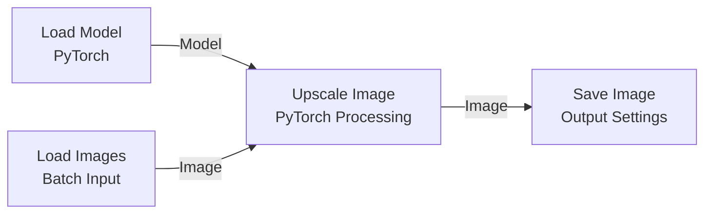
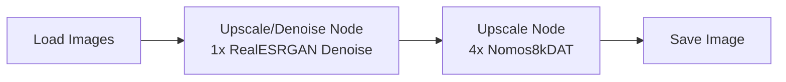
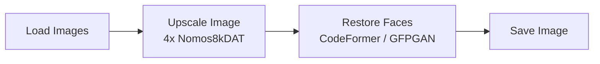

This guide covers setting up node-based batch image upscaling workflows in **chaiNNer**, understanding model architectures (such as **4x-Nomos8kDAT**), optimizing VRAM usage, and mastering advanced model chaining.

---

## 1. Quick Start: Batch Upscaling Workflow

The workflow below takes a folder of images, passes each image through a PyTorch model (`4x-Nomos8kDAT.pth`), and saves the upscaled results to an output folder.

### Node Flow Diagram

### Step-by-Step Setup

1. **Verify PyTorch Dependency**
   * Open chaiNNer.
   * Click the **Dependency Manager** (puzzle piece/download icon in the top-right header).
   * Ensure **PyTorch** is installed. (Required for running `.pth` models).

2. **Add Required Nodes**
   Search for and place the following four nodes onto the canvas grid:
   * **`Load Model (PyTorch)`** *(PyTorch > Load)*
   * **`Load Images`** *(Image > Batch Processing)*
   * **`Upscale Image`** *(PyTorch > Processing)*
   * **`Save Image`** *(Image > Input & Output)*

3. **Connect Node Handles**
   * `Load Model (PyTorch)` → `Model Output` ➔ `Upscale Image` → `Model Input`
   * `Load Images` → `Image Output` ➔ `Upscale Image` → `Image Input`
   * `Upscale Image` → `Image Output` ➔ `Save Image` → `Image Input`

4. **Configure Node Inputs**
   * **`Load Model (PyTorch)`**: Select your downloaded `4x-Nomos8kDAT.pth` file.
   * **`Load Images`**: Browse and select the source directory containing input images.
   * **`Save Image`**: Choose the output destination directory and configure file naming (e.g., `[name]_4x_DAT.[ext]`).

5. **Execute Workflow**
   * Click the green **Play** button ($lacktriangleright$) in the top navigation bar to begin processing the batch.

---

## 2. Model Architecture Breakdown

Understanding the architecture of your `.pth` model helps in choosing the right model for specific image types.

| Architecture | Description | Strengths | Best Used For |
| :--- | :--- | :--- | :--- |
| **DAT** *(Dual Aggregation Transformer)* | Combines spatial and channel attention mechanisms across dual transformer branches. | Exceptional detail preservation, high fidelity, sharp text & fine textures without heavy artifacts. | High-quality photos, textures, fine line art, architectural shots. |
| **ESRGAN** *(Enhanced Super-Resolution GAN)* | Classical Convolutional Neural Network (CNN) based on residual-in-residual dense blocks. | Fast inference, crisp lines, strong hallucinatory reconstruction for blurry sources. | General photos, textures, game textures. |
| **RealESRGAN** | Variant of ESRGAN trained on realistic synthetic degraded images. | Heavy noise removal, compression artifact removal. | Low-res internet images, compressed JPEGs, legacy photos. |
| **SwinIR / HAT** | Swin Transformer / Hybrid Attention Transformer architectures. | Top-tier perceptual quality and structural accuracy. | Maximum quality renders, archival photo restoration (High VRAM required). |
| **Compact / UltraCompact** | Lightweight convolutional networks. | Extremely lightweight, low memory overhead, very fast execution. | Video frames, low VRAM GPUs, real-time preview batching. |

### Featured Model: 4x-Nomos8kDAT

`4x-Nomos8kDAT` is the model used in the Quick Start workflow above, so it's worth knowing what it's good at:

* **Source:** [OpenModelDB Model Page](https://openmodeldb.info/models/4x-Nomos8kDAT)
* **Architecture:** DAT (Dual Aggregation Transformer)
* **Scale:** 4x
* **Trained on:** High-resolution 8K photography
* **Best Used For:** High-resolution photography, raw camera renders, detailed digital paintings, and fine textures.
* **Key Strength:** Preserves sharp natural details (skin texture, fabric, hair, foliage, stone) without producing the "waxy" or over-smoothed artifacts typical of older GAN architectures.

---

## 3. Model File Formats Explained

AI upscaling models come in several file formats:

* **`.pth` / `.pt` (PyTorch Checkpoint)**
  * **Pros:** Native format for most super-resolution research models; widely compatible in chaiNNer.
  * **Cons:** Requires PyTorch runtime; slower initial load times.
* **`.onnx` (Open Neural Network Exchange)**
  * **Pros:** Highly portable across runtimes (DirectML, TensorRT, NCNN, OpenVINO); faster execution on non-Nvidia GPUs.
  * **Cons:** Requires conversion from PyTorch; may lock batch sizes or resolution constraints if improperly converted.
* **`.safetensors`**
  * **Pros:** Safe binary format that prevents arbitrary code execution risks inherent to Python pickling (`.pth`). Fast loading.

---

## 4. VRAM & Performance Optimization

Large transformer models like **DAT** can easily consume significant VRAM at high resolutions. chaiNNer provides built-in mechanisms to handle large images safely.

### Tile-Based Processing

Instead of feeding a full 4K image into the GPU at once (which can crash with Out-Of-Memory / OOM errors):

* Enable **Tile Size** inside the `Upscale Image` node settings.
* **Recommended Tile Sizes**:
  * **4GB – 6GB VRAM:** `256` or `384`
  * **8GB – 12GB VRAM:** `512` or `768`
  * **16GB+ VRAM:** `1024` or Auto
* **Tile Margin / Padding:** Always set a small overlap (e.g., `16` or `32` pixels) to ensure seamless blending between tiles and prevent visible grid seams.

---

## 5. Advanced Workflow Patterns

### Pattern A: Two-Stage Upscaling (Restore + Scale)

For heavily degraded or noisy images, running a 4x DAT model directly can amplify noise. Chain a restoration model before scaling:

### Pattern B: Face Restoration Pipeline

When upscaling photos with human faces, add a face restoration node after the main upscaler:

---

## 6. Troubleshooting Common Issues

:::caution PyTorch Dependency Error
**Symptom:** `Load Model (PyTorch)` node displays a warning or fails to load.
**Fix:** Open **Dependency Manager** ($\downarrow$ icon top-right) $\rightarrow$ Reinstall **PyTorch** $\rightarrow$ Restart chaiNNer.
:::

:::danger CUDA Out of Memory (OOM)
**Symptom:** Workflow halts halfway through with `torch.cuda.OutOfMemoryError`.
**Fix:** Reduce the **Tile Size** on the `Upscale Image` node (e.g., lower from 512 to 256) and ensure no heavy background GPU tasks are running.
:::

:::info Seams / Grid Lines on Output
**Symptom:** Grid patterns appear on the upscaled output image.
**Fix:** Increase the **Tile Padding / Overlap** setting in the processing node to `32px` or higher.
:::

---

## 7. Where to Find Models

1. **[OpenModelDB](https://openmodeldb.info/)**
   * Centralized community database for finding and comparing upscaling models with side-by-side visual comparisons and architecture tags.

2. **[Hugging Face](https://huggingface.co/)**
   * Search for model repos under tags like `super-resolution`, `esrgan`, `dat`, or `hat`.

3. **[GitHub Releases](https://github.com)**
   * Original research repositories (e.g., Philip Hofmann's Nomos series, Xinntao's Real-ESRGAN, etc.) host raw `.pth` checkpoints under their Releases tabs.

---

## 8. Alternative GUI Tools to chaiNNer

| Tool | Type | License / Price | Best For |
| --- | --- | --- | --- |
| **[Upscayl](https://www.upscayl.org/)** | Desktop App | Free & Open-Source | Quick, one-click batch processing without setting up visual node trees. |
| **[QualityScaler](https://github.com/Djdefrag/QualityScaler)** | Desktop App | Free & Open-Source | Simple Windows UI focusing on PyTorch / BSRGAN models with automatic tiling. |
| **[ComfyUI](https://github.com/comfyanonymous/ComfyUI)** | Node-Based UI | Free & Open-Source | Deep pipelines integrating upscaling models directly with Stable Diffusion / Flux generation pipelines. |
| **[Topaz Gigapixel AI](https://www.topazlabs.com/topaz-gigapixel-ai)** | Commercial | Paid | Dedicated commercial desktop suite for RAW photo processing and print workflows. |

---
