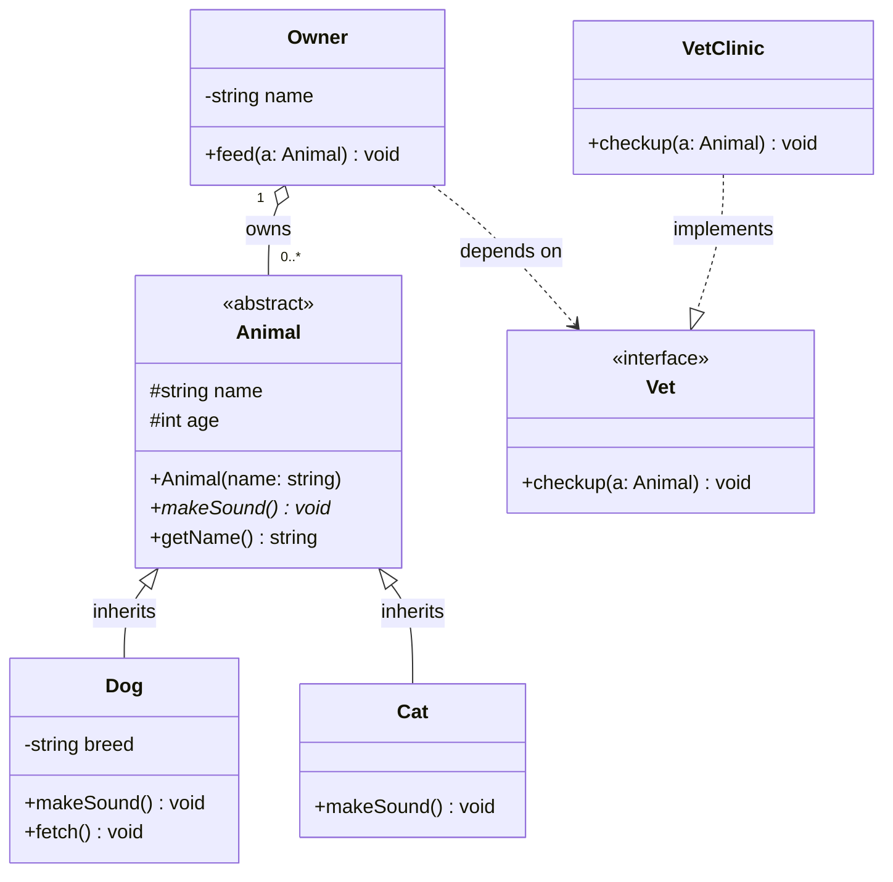
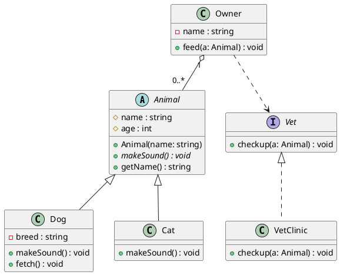

**UML (Unified Modeling Language)** is a standardized visual language for describing the structure and behavior of a software system. A UML diagram helps you visualize and document complex systems so that design intent survives beyond one person's head — useful for onboarding, code review, and just remembering *why* you built something a certain way.

:::tip Why bother with UML instead of just drawing boxes?
UML gives every shape, line, and arrowhead a precise, agreed-upon meaning. A dashed arrow doesn't mean the same thing as a solid one with a diamond — and once you know the notation, you can read *anyone's* diagram without a legend.
:::

## The Two Families of UML Diagrams

UML's 14 official diagram types fall into two buckets:

| Category | Focuses on | Examples |
|---|---|---|
| **Structural** | The system's static architecture — what things *are* and how they relate | Class, Object, Component, Deployment, Package |
| **Behavioral** | How components interact over time — what things *do* | Sequence, Use Case, Activity, State Machine |

The most commonly used diagrams in day-to-day engineering work are:

- **Class diagram** (structural) — the blueprint of your object model. Covered in depth below.
- **Sequence diagram** (behavioral) — shows objects exchanging messages in chronological order (great for API call flows).
- **Use case diagram** (behavioral) — shows actors and the actions/goals they can perform against a system.
- **Activity diagram** (behavioral) — a flowchart-like view of a process, with actions, decisions, and parallel flows.

Class diagrams are generally considered the most popular/common UML diagram because they map so directly onto object-oriented code (Java, C#, TypeScript classes, etc.) and double as living documentation for a codebase.

## A General Process for Creating Any UML Diagram

1. **Define the purpose.** What question should this diagram answer? "What are the entities and their relationships?" vs. "What happens, step by step, when a user checks out?"
2. **Identify the key elements.** Sketch the main components (classes, actors, objects) roughly before finalizing them.
3. **Establish relationships.** Map out how the elements connect — this is usually where the real design discussion happens.
4. **Refine and review.** Revisit with teammates; diagrams are cheap to redraw and expensive to get silently wrong.
5. **Pick the right tool** so the diagram stays version-controlled and easy to update (see [Tooling](#tooling-for-docs-as-code) below).

---

## Class Diagrams — Syntax & Conventions

A class diagram describes a system's classes, their **attributes**, **operations (methods)**, and the **relationships** between them.

### Anatomy of a Class Box

A class is drawn as a rectangle split into three compartments:

```
┌─────────────────────────────┐
│          ClassName           │  ← Class name (italics if abstract)
├─────────────────────────────┤
│ - attribute : Type           │  ← Attributes (fields)
│ + otherAttribute : Type      │
├─────────────────────────────┤
│ + operation(param: Type): T  │  ← Operations (methods)
│ - helperMethod(): void       │
└─────────────────────────────┘
```

**Visibility notation** (prefix before each member):

| Symbol | Meaning |
|---|---|
| `+` | public |
| `-` | private |
| `#` | protected |
| `~` | package/internal |

**Formatting conventions:**

- `underlined` member → `static` (class-level, not instance-level)
- *italicized* class name or method → `abstract`
- Constants are written in `ALL_CAPS` by convention
- Method signatures follow `name(paramName: ParamType): ReturnType`
- Special stereotypes use guillemets: `«interface»`, `«abstract»`, `«enumeration»`

### Relationships Cheat Sheet

This is the part people forget and re-Google every time — the arrows are not interchangeable.

| Relationship | Meaning | Line Style |
|---|---|---|
| **Association** | "uses / has a reference to" — a general structural link | Solid line, no arrowhead (or open arrowhead if directional) |
| **Aggregation** | "has a" (whole-part, but the part can exist independently) | Solid line, **hollow/open diamond** at the whole end |
| **Composition** | "owns a" (whole-part, part's lifecycle depends on the whole) | Solid line, **filled diamond** at the whole end |
| **Inheritance (Generalization)** | "is a" — subclass extends superclass | Solid line, **hollow triangle arrowhead** pointing to parent |
| **Realization (Implementation)** | Class implements an interface's contract | **Dashed line**, hollow triangle arrowhead |
| **Dependency** | "depends on temporarily" (e.g., a method parameter or local variable) | **Dashed line**, open arrowhead |

**Multiplicity** (cardinality) is written near each end of a relationship line:

| Notation | Meaning |
|---|---|
| `1` | exactly one |
| `0..1` | zero or one |
| `*` or `0..*` | zero or more |
| `1..*` | one or more |
| `n..m` | a specific range |

A memory trick: **aggregation = shared/loose ("has-a")**, **composition = exclusive/tight ("owns-a", dies with parent)**. Think "a `Team` *has* `Players`" (aggregation — a player can exist without the team) vs. "a `House` *is composed of* `Rooms`" (composition — a room doesn't exist without the house).

### Example: Mermaid Syntax (renders natively in Docusaurus)

Docusaurus supports Mermaid diagrams out of the box once you enable the `@docusaurus/theme-mermaid` plugin (add `markdown: { mermaid: true }` and the theme to `docusaurus.config.js`). This means the diagram source lives right in your Markdown and renders as an actual diagram — no external image files to keep in sync.

````markdown

````

This renders as:


**Mermaid relationship arrow syntax reference:**

| Mermaid Syntax | Relationship |
|---|---|
| `A --|> B` | Inheritance (A extends B) |
| `A ..|> B` | Realization (A implements interface B) |
| `A --* B` | Composition (A is composed of B) |
| `A --o B` | Aggregation (A aggregates B) |
| `A --> B` | Association (directed) |
| `A -- B` | Association (undirected) |
| `A ..> B` | Dependency (A depends on B) |
| `A ..  B` | Link (dashed, no semantics) |

### Example: PlantUML Syntax (common in Confluence/Jira via plugins)

PlantUML is the other dominant text-to-diagram syntax, frequently seen embedded in Confluence pages via macros (e.g. the PlantUML for Confluence marketplace app). It's slightly more terse:



The relationship symbols are nearly identical in spirit to Mermaid's (`<|--` inheritance, `<|..` realization, `o--` aggregation, `*--` composition, `-->` association, `..>` dependency) — the two ecosystems converged on very similar ASCII-art-for-arrows conventions since both are modeling the same UML spec.

---

## Other Diagram Types Worth Knowing (Quick Reference)

| Diagram | Type | Use it to show... |
|---|---|---|
| **Sequence** | Behavioral | The order messages are passed between objects/services over time (e.g., an API request lifecycle) |
| **Use Case** | Behavioral | Actors and the goals/actions they can perform against the system |
| **Activity** | Behavioral | A workflow or process, with decision branches and parallel paths (flowchart-like) |
| **State Machine** | Behavioral | The states an object can be in and the events that trigger transitions |
| **Object** | Structural | A snapshot of actual object *instances* and their links at a point in time |
| **Component** | Structural | High-level software components and the interfaces they expose/consume |
| **Deployment** | Structural | Physical/infrastructure nodes (servers, devices) and what's deployed on them |
| **Package** | Structural | How classes/namespaces are grouped into packages/modules |

## Common Mistakes to Avoid

- **Mixing up aggregation and composition** — if you're not sure whether the "part" can outlive the "whole," default to plain association; don't guess at a diamond.
- **Overloading one diagram with too much detail.** A class diagram meant to explain a domain model to a new teammate doesn't need every private helper method — trim to what serves the diagram's stated purpose.
- **Letting the diagram drift from the code.** Diagrams-as-code (Mermaid/PlantUML checked into the repo) solve this better than diagrams drawn once in a GUI tool and never updated.
- **Skipping multiplicity.** `Order` to `LineItem` being "one-to-many" vs. "one-to-one" is often the single most important fact the diagram is supposed to convey — don't leave it off.

## Tooling for Docs-as-Code

Since this page lives in a Docusaurus site, the two most practical options for keeping diagrams versioned alongside the docs are:

- **[Mermaid](https://mermaid.js.org/)** — via `@docusaurus/theme-mermaid`; syntax lives directly in fenced ` ```mermaid ` code blocks, no build step or external service needed.
- **[PlantUML](https://plantuml.com/)** — needs a rendering server (self-hosted or plantuml.com) or a build-time plugin (e.g. `docusaurus-plugin-plantuml`), but has a larger feature set and is the de facto standard for UML inside Confluence/Jira ecosystems, so it's worth knowing if you collaborate with teams using those tools.

Other general-purpose diagram tools that support UML notation (useful outside of docs-as-code, e.g. quick whiteboarding): [draw.io / diagrams.net](https://www.diagrams.net/), [Lucidchart](https://www.lucidchart.com/), and [Visual Paradigm](https://www.visual-paradigm.com/).

## Further Reading

- [Atlassian: What Is a UML Diagram](https://www.atlassian.com/work-management/project-management/uml-diagram)
- [Mermaid Class Diagram Docs](https://mermaid.js.org/syntax/classDiagram.html)
- [PlantUML Class Diagram Docs](https://plantuml.com/class-diagram)
