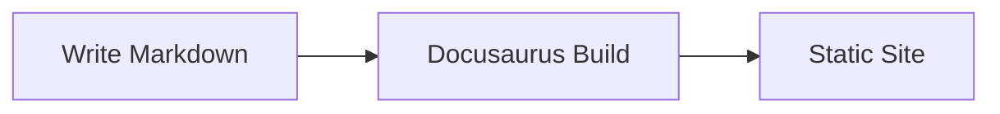

---
# --- Front Matter ---
# id: a unique identifier for this doc, used internally for linking.
#     Defaults to the filename if omitted.
id: docusaurus-syntax-reference

# title: the page's <h1> title and browser tab title.
#        If omitted, Docusaurus uses the first Markdown heading instead.
title: Docusaurus Syntax Reference

# sidebar_label: text shown in the sidebar nav. Defaults to `title` if omitted.
sidebar_label: Docusaurus Syntax Reference

# sidebar_position: controls ordering among sibling pages in the sidebar
#                    (lower numbers appear first).
sidebar_position: 1

# description: used for the page's meta description tag (SEO / link previews).
description: A living reference of Docusaurus-specific Markdown/MDX syntax and components.

# slug: overrides the page's URL path. Optional — omit to use the default
#       based on file path.
# slug: /syntax-reference

# tags: optional taxonomy tags, if your site uses the tags feature.
tags: [docusaurus, markdown, mdx, reference, syntax]
---

This page is a living reference for the special Markdown/MDX syntax and
built-in components Docusaurus supports, beyond standard Markdown. For each
feature below, the **raw source** is shown first, followed by the **live
rendered output**.

:::info A note on file type
This file has a `.md` extension, but Docusaurus compiles all Markdown files
through its MDX pipeline by default. That's why JSX imports (like the
`Tabs`/`TabItem` components used further down) work here even without
renaming the file to `.mdx`. A dedicated `.mdx` page will separately cover
embedding full custom React components.
:::

---

## Admonitions

Admonitions are callout blocks created with triple-colon syntax. Docusaurus
ships five types out of the box: `note`, `tip`, `info`, `warning`, and
`danger`.

### Basic syntax

**Source:**

```md
:::note
This is a note. Use it for neutral, supplementary information.
:::
```

**Rendered:**

:::note
This is a note. Use it for neutral, supplementary information.
:::

### All five types

**Source:**

```md
:::tip
A helpful suggestion or best practice.
:::

:::info
Neutral, informational context.
:::

:::warning
Something the reader should be careful about.
:::

:::danger
A critical warning — e.g. a destructive or irreversible action.
:::
```

**Rendered:**

:::tip
A helpful suggestion or best practice.
:::

:::info
Neutral, informational context.
:::

:::warning
Something the reader should be careful about.
:::

:::danger
A critical warning — e.g. a destructive or irreversible action.
:::

### Custom titles

The default title (e.g. "note", "tip") can be overridden with bracket syntax.

**Source:**

```md
:::note[Ephemeral by design]
Any changes you make via the console are temporary. They live in the
browser's in-memory DOM and disappear the moment you refresh or navigate
away. Nothing you do here modifies the server or the original source files.
:::
```

**Rendered:**

:::note[Ephemeral by design]
Any changes you make via the console are temporary. They live in the
browser's in-memory DOM and disappear the moment you refresh or navigate
away. Nothing you do here modifies the server or the original source files.
:::

---

## Code Blocks

Standard fenced code blocks support extra metadata: titles, and highlighted
lines.

### Titles + line highlighting (range syntax)

Add a title with `title="..."` and highlight specific lines with a range in
curly braces.

**Source:**

````md
```js title="src/utils/greet.js" {2,4-5}
function greet(name) {
  const trimmed = name.trim();
  if (!trimmed) {
    throw new Error('Name is required');
  }
  return `Hello, ${trimmed}!`;
}
```
````

**Rendered:**

```js title="src/utils/greet.js" {2,4-5}
function greet(name) {
  const trimmed = name.trim();
  if (!trimmed) {
    throw new Error('Name is required');
  }
  return `Hello, ${trimmed}!`;
}
```

### Highlighting via magic comments

Alternatively, highlight lines directly in the source using comments —
useful when line numbers shift often and you don't want to keep
recalculating a range.

**Source:**

````md
```js
function greet(name) {
  const trimmed = name.trim();
  // highlight-start
  if (!trimmed) {
    throw new Error('Name is required');
  }
  // highlight-end
  return `Hello, ${trimmed}!`;
}
```
````

**Rendered:**

```js
function greet(name) {
  const trimmed = name.trim();
  // highlight-start
  if (!trimmed) {
    throw new Error('Name is required');
  }
  // highlight-end
  return `Hello, ${trimmed}!`;
}
```

---

## Tabs

The `Tabs` and `TabItem` components let you group content — commonly used
for showing the same instructions across multiple package managers,
languages, or OSes.

**Source:**

````md
import Tabs from '@theme/Tabs';
import TabItem from '@theme/TabItem';

<Tabs>
  <TabItem value="npm" label="npm" default>
    ```bash
    npm install docusaurus-plugin-example
    ```
  </TabItem>
  <TabItem value="yarn" label="Yarn">
    ```bash
    yarn add docusaurus-plugin-example
    ```
  </TabItem>
  <TabItem value="pnpm" label="pnpm">
    ```bash
    pnpm add docusaurus-plugin-example
    ```
  </TabItem>
</Tabs>
````

**Rendered:**

import Tabs from '@theme/Tabs';
import TabItem from '@theme/TabItem';

<Tabs>
  <TabItem value="npm" label="npm" default>
    ```bash
    npm install docusaurus-plugin-example
    ```
  </TabItem>
  <TabItem value="yarn" label="Yarn">
    ```bash
    yarn add docusaurus-plugin-example
    ```
  </TabItem>
  <TabItem value="pnpm" label="pnpm">
    ```bash
    pnpm add docusaurus-plugin-example
    ```
  </TabItem>
</Tabs>

---

## Details / Collapsible Sections

Standard HTML `<details>`/`<summary>` tags work directly in Markdown and are
styled by Docusaurus's theme.

### Basic collapsible

**Source:**

```md
<details>
  <summary>Click to expand</summary>

  This content is hidden until the reader clicks the summary line above.
  Useful for FAQs, optional deep-dives, or long stack traces.
</details>
```

**Rendered:**

<details>
  <summary>Click to expand</summary>

  This content is hidden until the reader clicks the summary line above.
  Useful for FAQs, optional deep-dives, or long stack traces.
</details>

### Nested inside an admonition

Admonitions and `<details>` can be combined — handy for an optional
"technical details" aside inside a callout.

**Source:**

```md
:::tip
Here's a quick tip.

<details>
  <summary>Why does this work?</summary>

  Because Docusaurus's MDX pipeline allows HTML elements to be nested
  inside admonition blocks, not just plain text.
</details>
:::
```

**Rendered:**

:::tip
Here's a quick tip.

<details>
  <summary>Why does this work?</summary>

  Because Docusaurus's MDX pipeline allows HTML elements to be nested
  inside admonition blocks, not just plain text.
</details>
:::

---

## Line Numbers in Code Blocks

Add `showLineNumbers` to a code fence to display line numbers alongside the
code — combines with title and highlighting.

**Source:**

````md
```js title="src/utils/greet.js" showLineNumbers {3}
function greet(name) {
  const trimmed = name.trim();
  if (!trimmed) {
    throw new Error('Name is required');
  }
  return `Hello, ${trimmed}!`;
}
```
````

**Rendered:**

```js title="src/utils/greet.js" showLineNumbers {3}
function greet(name) {
  const trimmed = name.trim();
  if (!trimmed) {
    throw new Error('Name is required');
  }
  return `Hello, ${trimmed}!`;
}
```

## Tables

Docusaurus renders standard GitHub-flavored Markdown tables, with column
alignment controlled by colon placement in the separator row.

**Source:**

```md
| Feature      | Requires Plugin? | MDX Only? |
| :----------- | :---------------: | --------: |
| Admonitions  |         No         |        No |
| Tabs         |         No         |       Yes |
| Mermaid      |        Yes         |       Yes |
```

**Rendered:**

| Feature      | Requires Plugin? | MDX Only? |
| :----------- | :---------------: | --------: |
| Admonitions  |         No         |        No |
| Tabs         |         No         |       Yes |
| Mermaid      |        Yes         |       Yes |

---

## Footnotes

Standard Markdown footnote syntax is supported out of the box.

**Source:**

```md
Docusaurus is built on React.[^1] It also supports MDX.[^2]

[^1]: React is a UI library maintained by Meta.
[^2]: MDX lets you use JSX inside Markdown documents.
```

**Rendered:**

Docusaurus is built on React.[^1] It also supports MDX.[^2]

[^1]: React is a UI library maintained by Meta.
[^2]: MDX lets you use JSX inside Markdown documents.

---

## Mermaid Diagrams

If the `@docusaurus/theme-mermaid` plugin is enabled, fenced code blocks
labeled `mermaid` render as diagrams instead of plain code.

**Source:**

````md

````

**Rendered (requires the Mermaid plugin to be installed and enabled):**


:::warning Requires setup
Same caveat as npm2yarn and KaTeX above — needs `theme-mermaid` enabled in
config, and `markdown.mermaid: true` set.
:::

---

## Keyboard Keys

The `<kbd>` HTML tag is supported and styled by the theme — handy for
documenting shortcuts.

**Source:**

```md
Press <kbd>Ctrl</kbd> + <kbd>C</kbd> to copy.
```

**Rendered:**

Press <kbd>Ctrl</kbd> + <kbd>C</kbd> to copy.

---

## MDX Comments

Regular HTML comments (`<!-- -->`) get rendered into the output HTML source
(just hidden visually). To leave a comment that's fully stripped at build
time and never appears in page source, use JSX-style comments instead.

**Source:**

```md
<!-- This HTML comment ends up in the built page's HTML source, just hidden -->

{/* This JSX comment is fully removed at build time — use this for author-only notes */}
```

**Rendered:** nothing visible either way — the difference only shows up if
you view the page's built HTML source.
