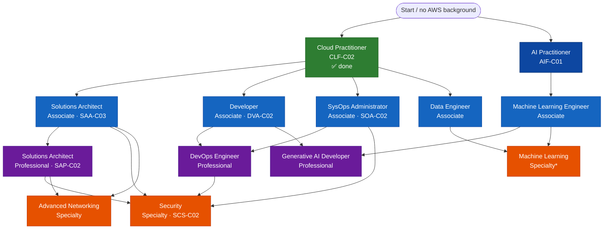

> **Why this page exists:** I earned the **AWS Certified Cloud Practitioner** certification but I'm not using AWS day-to-day right now. Knowledge that isn't written down fades fast — this page is my archive of what I learned, so future-me can re-load it in five minutes instead of re-doing a whole course.

## My certification status

| Certification | Status | Notes |
|---|---|---|
| AWS Certified Cloud Practitioner (CLF-C02) | ✅ Earned | Valid for **3 years** from pass date |

Certifications don't renew automatically — see [Recertification](#recertification) below for how to keep this alive without redoing the full exam.

---

## Core concepts (the stuff that fades first)

### What is cloud computing, really?

On-demand access to compute, storage, databases, and other IT resources over the internet, with **pay-as-you-go pricing** — instead of buying and maintaining your own physical servers.

- **CapEx → OpEx**: you stop spending capital upfront on hardware and instead pay operational expenses as you go.
- **Elasticity**: scale resources up or down automatically to match demand.
- **Global reach**: deploy an application in multiple regions around the world in minutes.

### AWS Global Infrastructure

- **Region**: a physical location in the world (e.g., `us-east-1` = N. Virginia, `eu-west-1` = Ireland). Each region is fully independent.
- **Availability Zone (AZ)**: one or more discrete data centers within a region, each with independent power, cooling, and networking. Every region has ≥3 AZs. Spreading resources across AZs = high availability.
- **Edge Locations**: sites used by **CloudFront** (AWS's CDN) and **Route 53** to cache content closer to users for lower latency. There are far more edge locations than regions.
- Choosing a region depends on: **latency** to users, **compliance/data residency**, **service availability**, and **cost** (prices differ by region).

### The Shared Responsibility Model

This is one of the most-tested Cloud Practitioner concepts:

- **AWS is responsible for security *of* the cloud** — physical infrastructure, hardware, global network, and the underlying services.
- **You are responsible for security *in* the cloud** — your data, IAM configuration, OS/network/firewall settings on what you control, encryption, and access management.
- The exact split shifts depending on the service (e.g., you manage more on EC2 than on a fully-managed service like Lambda or RDS).

### AWS Well-Architected Framework

Six pillars used to evaluate architectures:

1. **Operational Excellence** – run and monitor systems, continuously improve processes.
2. **Security** – protect data, systems, and assets.
3. **Reliability** – recover from failures, meet demand.
4. **Performance Efficiency** – use resources efficiently, adapt as needs change.
5. **Cost Optimization** – avoid unnecessary costs.
6. **Sustainability** – minimize environmental impact of running workloads.

---

## Core services cheat sheet

### Compute

- **EC2 (Elastic Compute Cloud)** — resizable virtual servers ("instances"). You choose instance type, OS, storage. Billed per second/hour depending on type.
- **Lambda** — serverless, run code without provisioning servers; billed per request + execution time. Great for event-driven workloads.
- **ECS / EKS** — container orchestration (ECS = AWS-native, EKS = managed Kubernetes).
- **Elastic Beanstalk** — PaaS: upload code, AWS handles provisioning, load balancing, scaling.

### Storage

- **S3 (Simple Storage Service)** — object storage (files, not a filesystem/block device). Virtually unlimited, extremely durable (11 nines). Has storage *classes* (Standard, Infrequent Access, Glacier for archiving) to trade cost vs. retrieval speed.
- **EBS (Elastic Block Store)** — block storage attached to a single EC2 instance (like a virtual hard drive).
- **EFS (Elastic File System)** — managed, shared file storage that multiple EC2 instances can mount at once.

### Databases

- **RDS (Relational Database Service)** — managed relational databases (MySQL, PostgreSQL, etc.); AWS handles patching, backups, failover.
- **DynamoDB** — fully managed NoSQL key-value/document database, serverless, scales automatically.
- **Redshift** — data warehousing for analytics at scale.

### Networking

- **VPC (Virtual Private Cloud)** — your own isolated, private network within AWS. Subnets, route tables, internet/NAT gateways, security groups all live here.
- **Route 53** — DNS service (also does health checks and traffic routing).
- **CloudFront** — CDN, caches content at edge locations.
- **ELB (Elastic Load Balancer)** — distributes incoming traffic across multiple targets.

### Security & Identity

- **IAM (Identity and Access Management)** — users, groups, roles, and policies to control *who* can do *what*. Free to use.
  - Principle of **least privilege**: grant only the permissions needed.
  - **Roles** vs **Users**: roles are temporary, assumable credentials (e.g., an EC2 instance assuming a role to access S3) — preferred over hardcoding access keys.
- **Root user**: the account owner login — should be locked down with MFA and basically never used day-to-day.
- **Organizations** — manage multiple AWS accounts centrally, consolidated billing.

### Management & Monitoring

- **CloudWatch** — metrics, logs, alarms, dashboards for monitoring resources.
- **CloudTrail** — logs *who did what* (API calls/account activity) — auditing, not performance monitoring.
- **CloudFormation** — Infrastructure as Code: define resources in YAML/JSON templates, deploy repeatably.
- **Trusted Advisor** — automated recommendations across cost, performance, security, fault tolerance.

---

## Pricing & billing

- **Pay-as-you-go**: no upfront commitment for on-demand pricing.
- **Free Tier**: 12-months-free, always-free, and short-term trial offers on select services.
- **Savings mechanisms**:
  - **Reserved Instances / Savings Plans** — commit to 1 or 3 years for a discount vs. on-demand.
  - **Spot Instances** — bid on spare EC2 capacity for up to ~90% discount; AWS can reclaim it with short notice — good for fault-tolerant/flexible workloads, bad for anything critical.
- **Cost tools**:
  - **AWS Pricing Calculator** — estimate costs before deploying.
  - **Cost Explorer** — visualize and analyze historical spend.
  - **AWS Budgets** — set custom cost/usage alerts.
- **Support Plans**: Basic (free) → Developer → Business → Enterprise, increasing in response time and access to a Technical Account Manager (TAM).

---

## AWS Certification Roadmap

AWS certifications are grouped into four levels. As of 2026 there are roughly a dozen active certifications (the exact count shifts as AWS retires/adds exams — always check the [official certification page](https://aws.amazon.com/certification/) for the current list).

### 1. Foundational

*No deep prior experience required — good entry point for technical and non-technical roles alike.*

- **AWS Certified Cloud Practitioner (CLF-C02)** ✅ *(mine)* — broad, high-level overview of AWS Cloud, core services, security, and billing.
- **AWS Certified AI Practitioner (AIF-C01)** — foundational understanding of AI/ML and generative AI concepts on AWS.

### 2. Associate

*Prior hands-on cloud/IT experience recommended.*

- **AWS Certified Solutions Architect – Associate (SAA-C03)** — designing available, cost-efficient, fault-tolerant architectures. Usually the natural "next step" after Cloud Practitioner.
- **AWS Certified Developer – Associate (DVA-C02)** — developing and maintaining applications on AWS.
- **AWS Certified SysOps Administrator – Associate (SOA-C02)** — deployment, management, and operations; includes a hands-on lab component.
- **AWS Certified Data Engineer – Associate** — data pipelines, ingestion, transformation on AWS.
- **AWS Certified Machine Learning Engineer – Associate** — implementing and operating ML solutions.

### 3. Professional

*2+ years of AWS experience recommended — these are hard, scenario-heavy exams.*

- **AWS Certified Solutions Architect – Professional (SAP-C02)** — advanced, complex architecture, migration, cost governance.
- **AWS Certified DevOps Engineer – Professional** — CI/CD, automation, monitoring at scale.
- **AWS Certified Generative AI Developer – Professional** — building production-grade GenAI systems (e.g., with Amazon Bedrock).

### 4. Specialty

*Deep expertise in one domain — good for a targeted career pivot rather than a full ladder-climb.*

- **AWS Certified Security – Specialty**
- **AWS Certified Advanced Networking – Specialty**
- **AWS Certified Machine Learning – Specialty** *(being phased out — check current status before starting this one)*
- (Others have been retired over time, e.g. Data Analytics, Database, SAP on AWS — AWS periodically retires specialty exams as the associate-level exams absorb that content.)

### Full roadmap (all paths)

*`Machine Learning – Specialty` is being phased out in favor of the ML Engineer Associate + Generative AI Developer Professional combo — check current status before starting it.

**Reading the diagram:** pick a role-based lane once you're past Cloud Practitioner rather than trying to collect every associate cert. The dotted-looking convergence at Professional/Specialty level (e.g., SysOps *and* Developer both feeding into DevOps Professional) means either associate cert is accepted prep for that next exam — you don't need both.

**My plan:** Cloud Practitioner ✅ → next logical step is **Solutions Architect – Associate (SAA-C03)**, since it builds directly on Cloud Practitioner content but goes hands-on with actual architecture decisions. Longer term, that opens the door to either Solutions Architect Professional or a Specialty (Security is the most broadly useful).

### General notes on requirements

- No certification has a strict *enforced* prerequisite — you can technically walk into a Professional exam cold — but AWS explicitly recommends the relevant experience level, and the exams are calibrated assuming it.
- Foundational: ~$100 per exam. Associate: ~$150. Professional/Specialty: ~$300. (Check the [certification page](https://aws.amazon.com/certification/) for current pricing — these change.)
- Passing any cert gets you a **50% discount voucher** toward your next exam.

---

## Recertification

Confirmed against AWS's official policy:

- All AWS certifications are **valid for 3 years** from the date you pass the exam.
- To stay active, you must recertify **before** the 3-year expiration — AWS does **not** accept continuing-education credits, only retesting (or one of the alternate paths below).
- AWS sends reminder emails at 12, 6, and 3 months before expiration — but it's on you to track it.
- **Foundational and Associate certs** can also be auto-renewed by passing a **higher-level** exam in the same track — e.g., passing SAA-C03 also recertifies Cloud Practitioner.

### ✅ Fact-check: "6 months before expiry, you can recertify via AWS Cloud Quest"

**Confirmed correct.** Specifically for **Cloud Practitioner**:

- You become eligible for **AWS Cloud Quest: Recertify Cloud Practitioner** once your certification is **within 6 months of its expiration date**.
- It's a free, game-based, self-paced option on AWS Skill Builder — no exam or exam prep needed.
- Completing all the required quests **extends your certification for another 3 years**, same as retaking the exam would.
- Alternative recertification routes for Cloud Practitioner: pass the current CLF-C02 exam again, **or** pass any Associate/Professional-level exam (which also certifies you know more than Cloud Practitioner content anyway).

📌 **Action item for future me:** check my cert's expiry date, and once within 6 months of it, go do the Cloud Quest recertification rather than paying for/re-studying the full exam.

---

## Useful links

- 🎯 [AWS Certified Solutions Architect – Associate (SAA-C03) Exam Prep Plan](https://skillbuilder.aws/learning-plan/UYRXS2DF85/exam-prep-plan-aws-certified-solutions-architect--associate-saac03--english/U991QUF9C3) — my likely next certification.
- ⭐ [AWS Cloud Practitioner Essentials](https://skillbuilder.aws/learn/94T2BEN85A/aws-cloud-practitioner-essentials/8D79F3AVR7?parentId=1J2VTQSGU2) — the course that actually made AWS concepts click. **Re-watch this first if starting from zero again.**
- 🗺️ [AWS Certification — official overview of all certifications](https://aws.amazon.com/certification/)
- 🔁 [AWS Cloud Quest: Recertify Cloud Practitioner](https://skillbuilder.aws/learn/WWVDFJCJVB/aws-cloud-quest-recertify-cloud-practitioner/8CK11R6JYW) — use this ~6 months before my cert expires instead of a full retake.

---

## Quick-reference glossary

| Term | Meaning |
|---|---|
| IAM | Identity and Access Management — who can do what |
| VPC | Your isolated private network in AWS |
| S3 | Object storage |
| EC2 | Virtual servers |
| RDS | Managed relational database |
| Lambda | Serverless functions |
| AZ | Availability Zone — a data center cluster within a region |
| Region | A geographic AWS location containing multiple AZs |
| CloudFormation | Infrastructure as Code |
| CloudWatch | Monitoring/metrics/alarms |
| CloudTrail | Auditing/API activity logs |
| MFA | Multi-Factor Authentication |
| SLA | Service Level Agreement |
| TCO | Total Cost of Ownership |
