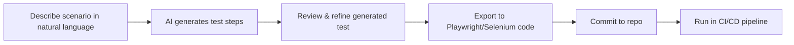

Personal notes from a course on modern software testing — covering *why* testing matters, hands-on browser automation with **Playwright**, and the emerging role of **AI-powered testing tools** like KaneAI.

:::tip Why this page exists
Testing knowledge decays fast if it isn't written down. This page is meant to be the thing I re-read in six months instead of re-learning from scratch.
:::

---

## 1. Why Testing Matters

Testing is best thought of as **insurance for your code** — you pay a small, predictable cost upfront (writing tests) to avoid a large, unpredictable cost later (production failures, lost revenue, reputational damage, or worse).

Two case studies drive this home:

### Knight Capital (2012)

A deployment error left old, dormant code active on one of eight production servers. That leftover code was accidentally triggered, causing the system to execute unintended trades at a massive scale. The result: roughly **$440 million lost in 45 minutes**, nearly bankrupting the firm. The root cause wasn't a single "bug" in the traditional sense — it was a **deployment/testing process failure**: no reliable way to verify that all servers were running the correct, current code before going live.

**Lessons:**

- Deployment configuration is part of your system under test — verify it.
- Dead/legacy code paths are latent risk; remove or explicitly test them.
- Fast systems need fast *safety nets* (kill switches, monitoring, canary releases), not just fast pipelines.

### Boeing 737 MAX (MCAS)

The Maneuvering Characteristics Augmentation System (MCAS) was designed to automatically push the aircraft's nose down under certain conditions, based on input from a single angle-of-attack sensor. Faulty sensor readings triggered MCAS incorrectly, and the system lacked adequate safeguards, redundancy, or pilot documentation. This contributed to two fatal crashes.

**Lessons:**

- **Single points of failure** (one sensor, no redundancy/cross-check) are a testing and design smell — test for sensor/input failure, not just the happy path.
- Safety-critical systems need **failure-mode testing**: what happens when an input is *wrong*, not just *missing*?
- Documentation and training are part of the "system" — untested assumptions about what operators know are still bugs.

:::note Takeaway
Both cases share a pattern: the failure wasn't in the "obvious" logic, it was in an **edge case, an untested interaction, or an unverified assumption**. Good testing strategy specifically hunts for these.
:::

---

## 2. The Testing Pyramid

A mental model for how to *allocate effort* across test types, balancing speed, confidence, and cost.

```
        /\
       /  \        E2E Tests (few)
      /----\       — slow, expensive, high confidence
     /      \
    / Integ. \     Integration Tests (some)
   /----------\    — medium speed, verifies components work together
  /            \
 /  Unit Tests  \  Unit Tests (many)
/----------------\ — fast, cheap, isolated
```

| Layer | Scope | Speed | Cost | Purpose |
|---|---|---|---|---|
| **Unit tests** | A single function/class/module, in isolation (mocks/stubs for dependencies) | Very fast (ms) | Low | Catch logic errors close to the source; fast feedback loop |
| **Integration tests** | Multiple components/modules working together (e.g., service + database, frontend + API) | Medium | Medium | Catch issues in the *seams* — where units are individually correct but don't work together |
| **E2E tests** | Full system, simulating real user behavior through the actual UI/API | Slow (seconds–minutes) | High | Catch issues only visible when the whole system runs together; highest confidence, most brittle |

**Practical rule of thumb:** write *many* unit tests, a *reasonable number* of integration tests, and a *small, high-value set* of E2E tests focused on critical user journeys (login, checkout, search) rather than trying to E2E-test everything.

:::caution Anti-pattern: the "Ice Cream Cone"
A common failure mode is the pyramid flipped upside down — teams rely heavily on slow, flaky E2E tests and skip unit tests. This leads to slow CI pipelines, flaky builds, and low confidence about *why* something failed.
:::

---

## 3. Hands-on Automation with Playwright

Practiced against a sample app called **TechMart** (e-commerce style: search, cart, login, checkout, APIs).

### 3.1 Setup

```bash
npm init playwright@latest
```

This scaffolds:

- `playwright.config.ts` — browser projects (Chromium, Firefox, WebKit), base URL, timeouts, retries
- `tests/` — example test files
- Config for running headless/headed, in parallel, and across multiple browsers/viewports

```ts
// playwright.config.ts (key options worth remembering)
export default defineConfig({
  testDir: './tests',
  fullyParallel: true,
  retries: process.env.CI ? 2 : 0,
  use: {
    baseURL: 'https://techmart.example.com',
    trace: 'on-first-retry',
    screenshot: 'only-on-failure',
  },
  projects: [
    { name: 'chromium', use: { ...devices['Desktop Chrome'] } },
    { name: 'firefox', use: { ...devices['Desktop Firefox'] } },
    { name: 'webkit', use: { ...devices['Desktop Safari'] } },
  ],
});
```

### 3.2 Core Test Writing

Core scenarios practiced on TechMart:

- **Search** — typing a query, verifying result count/content, handling "no results" state.
- **Shopping cart** — add/remove items, quantity updates, price recalculation, persistence across navigation.
- **Login forms** — valid/invalid credentials, validation messages, redirect behavior.
- **API endpoints** — testing backend responses directly via Playwright's `request` fixture, independent of the UI.

```ts
import { test, expect } from '@playwright/test';

test('user can search for a product', async ({ page }) => {
  await page.goto('/');
  await page.getByPlaceholder('Search products').fill('headphones');
  await page.keyboard.press('Enter');

  await expect(page.getByTestId('search-results')).toContainText('headphones');
});

test('adding an item updates the cart badge', async ({ page }) => {
  await page.goto('/products/wireless-headphones');
  await page.getByRole('button', { name: 'Add to cart' }).click();

  await expect(page.getByTestId('cart-count')).toHaveText('1');
});

test('API: fetching product list returns 200', async ({ request }) => {
  const response = await request.get('/api/products');
  expect(response.status()).toBe(200);
  const body = await response.json();
  expect(Array.isArray(body.products)).toBeTruthy();
});
```

**Key Playwright concepts to remember:**

- **Locators are lazy** — `page.getByRole(...)` doesn't query the DOM until an action/assertion is performed, and it auto-waits.
- **Auto-waiting** — Playwright retries assertions like `expect(locator).toHaveText(...)` until they pass or time out, which reduces flaky tests compared to manual `sleep()`/`wait()` calls.
- **Fixtures** (`page`, `request`, `context`) are dependency-injected per test — no manual browser lifecycle management needed.
- Prefer **role/text/testid-based locators** over CSS selectors tied to implementation details (classes, DOM structure) — they're more resilient to UI refactors.

### 3.3 Advanced Techniques

#### Edge case & security testing (XSS)

Testing isn't just "does the happy path work" — it's "does the system behave safely when it *shouldn't* work."

```ts
test('search input is sanitized against XSS', async ({ page }) => {
  await page.goto('/');
  await page.getByPlaceholder('Search products').fill('<script>alert(1)</script>');
  await page.keyboard.press('Enter');

  // The payload should render as inert text, not execute
  await expect(page.locator('body')).not.toContainText('alert(1)');
  const dialogFired = await page
    .waitForEvent('dialog', { timeout: 1000 })
    .then(() => true)
    .catch(() => false);
  expect(dialogFired).toBe(false);
});
```

Other edge cases worth covering: empty inputs, extremely long strings, unicode/emoji, negative quantities, race conditions from double-clicking "Add to cart", and boundary values (0, max int, etc.).

#### API mocking (simulating network failures)

Playwright can intercept network calls to simulate slow networks, downtime, or malformed responses — without touching the real backend.

```ts
test('shows an error message when the API fails', async ({ page }) => {
  await page.route('**/api/products', route =>
    route.fulfill({ status: 500, body: 'Internal Server Error' })
  );

  await page.goto('/products');
  await expect(page.getByText(/something went wrong/i)).toBeVisible();
});

test('handles a slow network gracefully', async ({ page }) => {
  await page.route('**/api/products', async route => {
    await new Promise(resolve => setTimeout(resolve, 3000));
    route.continue();
  });

  await page.goto('/products');
  await expect(page.getByTestId('loading-spinner')).toBeVisible();
});
```

This is essential for testing **resilience** — most bugs users hit in production come from the network being imperfect, not perfect.

#### Accessibility testing with Axe Core

Using `@axe-core/playwright` to automatically scan pages for WCAG violations.

```bash
npm install -D @axe-core/playwright
```

```ts
import { test, expect } from '@playwright/test';
import AxeBuilder from '@axe-core/playwright';

test('homepage has no detectable accessibility violations', async ({ page }) => {
  await page.goto('/');
  const results = await new AxeBuilder({ page }).analyze();
  expect(results.violations).toEqual([]);
});
```

Axe catches things like missing alt text, insufficient color contrast, missing form labels, and improper ARIA usage — issues that are easy to miss manually but block real users (e.g., screen reader users) from using the product.

:::info Good practice
Automated accessibility scans (Axe) catch ~30-50% of accessibility issues. They're a great baseline, but manual testing (keyboard-only navigation, screen readers) is still needed for full coverage.
:::

---

## 4. AI-Powered Testing

### 4.1 KaneAI

KaneAI represents a newer generation of AI-driven testing tools. Key capabilities explored:

- **Natural language test generation** — describe a test scenario in plain English (e.g., "search for headphones and verify results appear"), and the tool generates the corresponding automated test steps.
- **Auto-healing** — when the underlying UI changes (a button's selector or layout shifts), traditional automated tests break because locators no longer match. Auto-healing tools attempt to detect the change and automatically update the test's locator/logic, reducing maintenance overhead.
- **API testing support** — using natural language or AI assistance to construct and validate API requests, similar in spirit to tools like Postman but with AI-assisted test generation.

### 4.2 Exporting to Professional Frameworks

A key workflow: use AI tools like KaneAI to *rapidly prototype* test scenarios, then **export the generated tests into Playwright** (or similar frameworks) so they can run inside standard **CI/CD pipelines** — version controlled, code-reviewed, and integrated with the rest of the engineering workflow, rather than living only inside a proprietary AI tool.



### 4.3 AI as a Multiplier, Not a Replacement

The consistent framing across the course: AI tools are a **productivity multiplier**, not a substitute for testing judgment.

- AI is good at: generating boilerplate quickly, suggesting edge cases you might not think of, healing brittle selectors, and lowering the barrier for non-engineers (manual QA, PMs) to write automated checks.
- Humans are still needed for: deciding *what's actually business-critical* to test, designing test strategy (what belongs in unit vs. integration vs. E2E), catching subtle logic/UX issues AI won't flag, and validating that AI-generated tests actually assert the right thing (not just "the page loaded").

---

## 5. Final Takeaways

1. **Start testing early** — retrofitting tests onto an untested codebase is far more expensive than writing them alongside the code.
2. **Focus on business-critical paths first** — login, checkout, payment, search — not 100% coverage for its own sake.
3. **Respect the pyramid** — lots of fast unit tests, some integration tests, few but meaningful E2E tests.
4. **Test failure modes, not just success** — XSS, network failures, bad input, single points of failure. This is where Knight Capital and the 737 MAX both failed.
5. **Accessibility is a testable, automatable requirement**, not an afterthought — bake it into the pipeline with tools like Axe Core.
6. **Treat AI testing tools as an accelerant** for coverage and maintenance (auto-healing, natural language generation) — while still owning the strategy and judgment calls yourself.
