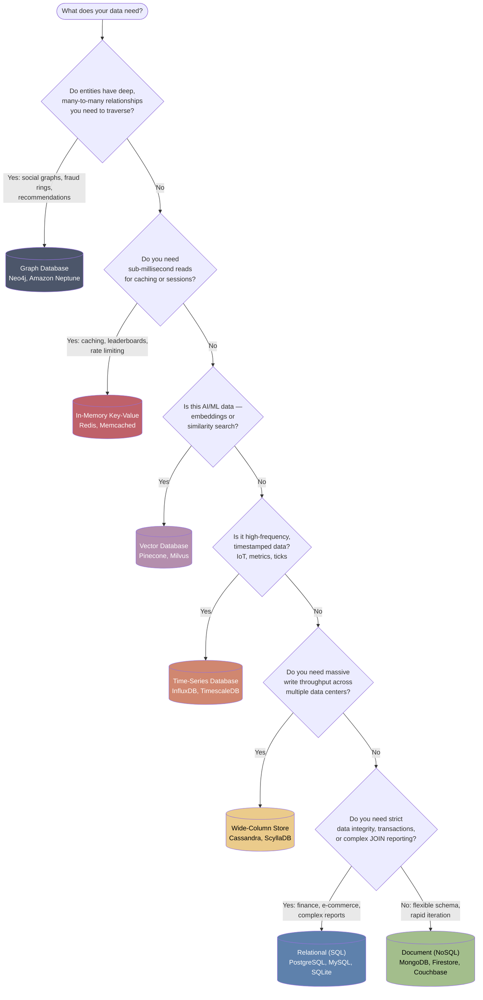

Choosing the right database is one of those decisions that's easy to get wrong early and expensive to fix later. This guide gives you a decision flowchart plus a breakdown of each database family so you can pick with confidence.

## Quick Decision Flowchart

Start at the top and follow the path that matches your primary need.

:::tip Rule of thumb
If you're still unsure, default to **PostgreSQL**. It handles relational data well and has solid extensions for JSON, full-text search, and even vector search — so you can outgrow it slowly instead of migrating early.
:::

## Comparison at a Glance

| Type | Examples | Best For | Main Trade-off |
|---|---|---|---|
| Relational (SQL) | PostgreSQL, MySQL, SQLite | Financial ledgers, e-commerce, reporting | Rigid schema, harder to scale horizontally |
| Document (NoSQL) | MongoDB, Firestore, Couchbase | Prototyping, user profiles, CMS | Weak multi-record relationships/aggregation |
| In-Memory (Key-Value) | Redis, Memcached | Caching, sessions, leaderboards | Volatile, limited by RAM |
| Graph | Neo4j, Amazon Neptune | Social networks, fraud detection | Steep learning curve (Cypher, etc.) |
| Vector | Pinecone, Milvus | AI/LLM embeddings | Niche use case, extra infra |
| Time-Series | InfluxDB, TimescaleDB | IoT, metrics, stock ticks | Niche use case, specialized queries |
| Wide-Column | Cassandra, ScyllaDB | Massive global write volume | Operationally complex |

## 1. Relational (SQL)

- **Examples:** PostgreSQL, MySQL, SQLite, Firebase SQL Connect
- **Data Structure:** Rigid tables with rows, columns, and foreign keys.
- **Best For:** Financial ledgers, e-commerce, complex reporting.
- **Pros:** Bulletproof data integrity, powerful multi-table JOIN queries.
- **Cons:** Harder to scale horizontally, requires strict schema migrations.

## 2. Document (NoSQL)

- **Examples:** MongoDB, Firebase Firestore, Couchbase
- **Data Structure:** Flexible, schemaless JSON-like documents.
- **Best For:** Rapid prototyping, user profiles, content management.
- **Pros:** Easy to change data structures, scales out automatically.
- **Cons:** Poor support for complex relationship queries and data aggregations.

## 3. In-Memory (Key-Value)

- **Examples:** Redis, Memcached
- **Data Structure:** Ultra-fast key-value pairs stored in RAM.
- **Best For:** User session caching, real-time leaderboards, speed optimization.
- **Pros:** Sub-millisecond response times.
- **Cons:** Volatile data storage if not backed up; restricted by RAM size.

## 4. Graph Databases

- **Examples:** Neo4j, Amazon Neptune
- **Data Structure:** Interconnected "Nodes" (entities) and "Edges" (relationships).
- **Best For:** Social networks, fraud detection, recommendation engines.
- **Pros:** Fast querying of deeply nested relationships without slow JOIN operations.
- **Cons:** High learning curve for graph query languages (like Cypher).

## 5. Niche / Specialized

- **Vector** (Pinecone, Milvus): Stores AI and LLM data embeddings.
- **Time-Series** (InfluxDB, TimescaleDB): Logs high-frequency data like IoT sensors and stock ticks.
- **Wide-Column** (Cassandra, ScyllaDB): Handles massive global write volumes across multiple data centers.
